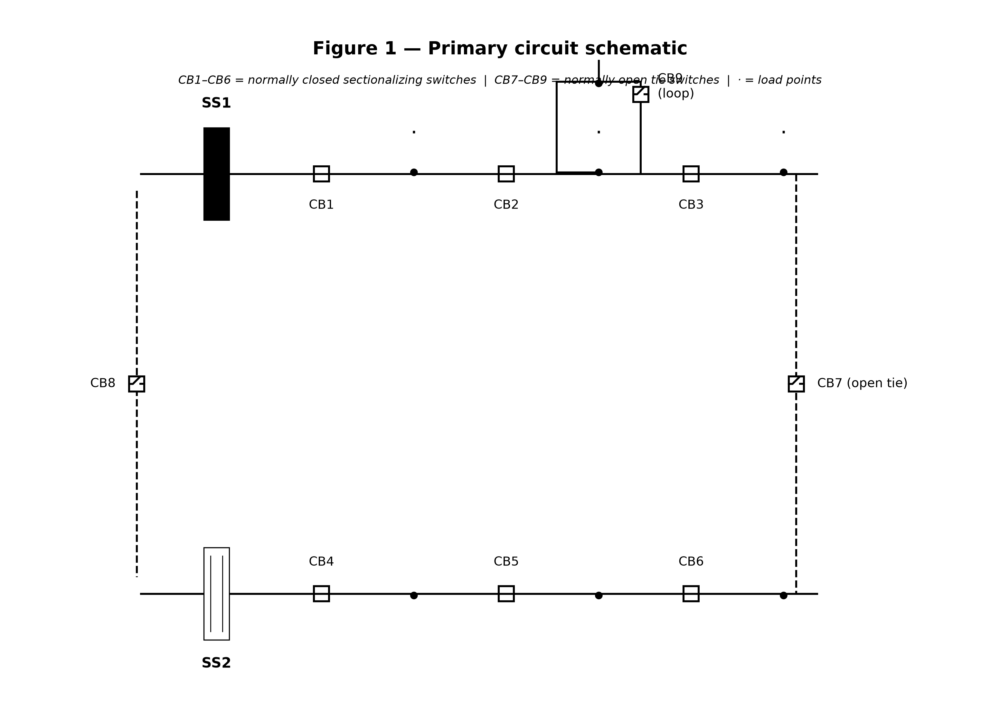
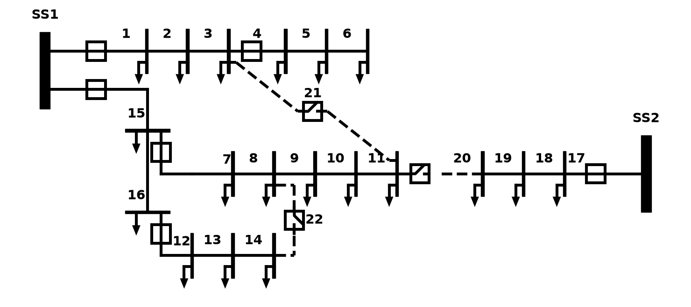
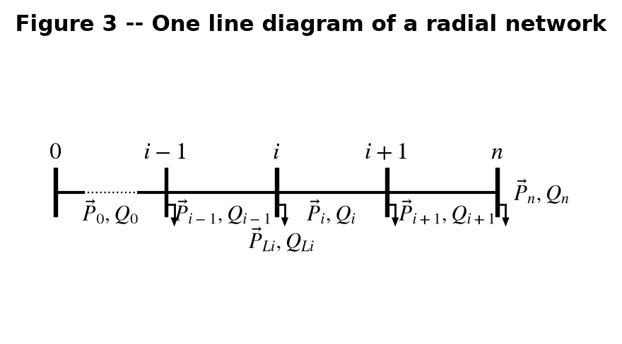
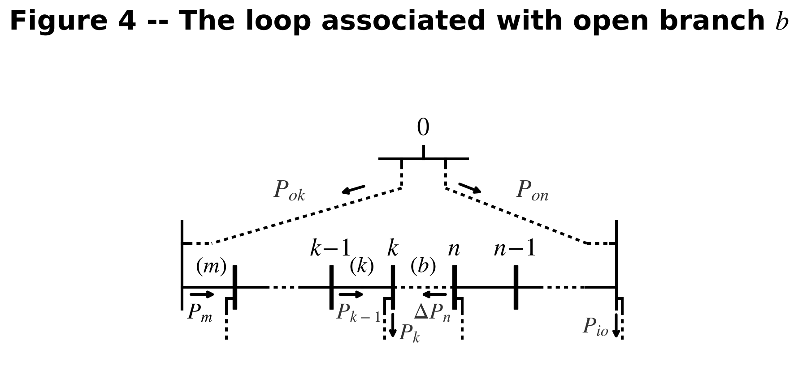

<div align="center">

# IeeeTopologyDiagrams

> **AI-Reproducible IEEE 33-Bus One-Line Diagram Drawing Primitives** | IEEE 33 节点配电网络单线图绘制基元 · AI 可复现 · AI Skill 直接集成到 Trae / Cursor / Claude Code

[](https://badge.fury.io/py/IeeeTopologyDiagrams)
[](https://pypi.org/project/IeeeTopologyDiagrams/)
[](https://opensource.org/licenses/MIT)
[](https://en.wikipedia.org/wiki/Distribution_network_reconfiguration)
[](https://github.com/lizhanlian/IeeeTopologyDiagrams)
[](https://github.com/lizhanlian/IeeeTopologyDiagrams)

<br>

**🤖 AI-Reproducible IEEE 33-Bus Topology Diagrams — Generate complete one-line diagrams by simply typing instructions in Trae IDE / Cursor / Claude Code.**<br>
**🤖 AI 可复现的 IEEE 33 节点拓扑图 — 在 Trae IDE / Cursor / Claude Code 中输入指令即可生成完整单线图。**

<sub>**Each drawing script header contains a complete AI prompt parameter dictionary + bilingual (CN/EN) step-by-step drawing instructions. Copy them directly into any AI conversation to reproduce the exact same figures.** 除脚本方式外，本项目还提供标准 **AI Skill** 扩展（`skills/baran-wu-figures/`），已适配 Trae IDE、Cursor、Claude Code 等 AI 编程环境。</sub>

<br>

[简介 / Intro](#简介--intro) · [AI Skill 是什么 / What is AI Skill](#ai-skill-是什么--what-is-ai-skill) · [安装 / Install](#安装--install) · [功能特性 / Features](#功能特性--features) · [IEEE 33 节点拓扑图 / IEEE 33-Bus Topology](#ieee-33-节点拓扑图--ieee-33-bus-topology) · [完整示意图 / Full Diagrams](#🖼️-完整示意图--full-diagrams) · [绘图基元 / Drawing Primitives](#绘图基元--drawing-primitives) · [AI Skill 使用方法 / How to Use](#ai-skill-使用方法--how-to-use) · [命令行工具 / CLI](#命令行工具--cli) · [鸣谢 / Acknowledgments](#acknowledgments--鸣谢) · [参考文献 / References](#参考文献--references)

</div>

---

## 简介 / Intro

**IEEE 33-Bus Distribution System** (IEEE 33 节点配电系统) is a widely used benchmark in distribution network reconfiguration, reactive power optimization, distributed generation planning, fault location & isolation, and microgrid operation research.

本项目的核心价值在于 **AI-Reproducible (AI 可复现)**：not only provides drawing functions, but also comes with a complete **AI Skill** extension — plug-and-play, enabling AI to draw IEEE 33-bus topology diagrams identical to the original paper.

This project implements reproducible drawing of all IEEE 33-bus topology diagrams from the Baran & Wu (1989) paper, covering **Substation**, **Bus**, **Circuit Breaker (CB)**, **Distribution Feeder**, **Branch Power Flow**, and **Load Injection** — all standard power system drawing primitives.

每个绘图脚本头部包含**完整参数字典 + 中英文分步绘制说明**，任何人或 AI 都可以按照步骤精确复现 IEEE 33 节点拓扑图、IEEE 33 节点单线图，以及 Baran & Wu 原始论文的 Figure 1–Figure 4。

> M.E. Baran, F.F. Wu, "Network Reconfiguration in Distribution Systems for Loss Reduction and Load Balancing," *IEEE Trans. Power Delivery*, Vol. 4, No. 2, pp. 1401-1407, 1989.

**Research Areas / 适用研究方向：** Distribution network reconfiguration, reactive power optimization, distributed generation integration, distribution reliability assessment, microgrid optimization, distribution fault restoration, three-phase power flow analysis.

---

## 安装 / Install

```bash
pip install IeeeTopologyDiagrams
```

---

## 功能特性 / Features

| Category / 类别 | Feature / 功能 | Status |
|------|------|:----:|
| **Switchgear / 开关设备** | NCB / NOCB (horizontal/vertical) | ✅ |
| **Substation / 变电站** | Solid rectangle / Hollow double-line styles | ✅ |
| **Bus Nodes / 母线节点** | Vertical bar / Horizontal bar / Switched / Connection point | ✅ |
| **Load & Transformer / 负荷变压器** | Load injection node / Distribution transformer symbol | ✅ |
| **Loop Power Labels / 环路功率标注** | Figure 4 complete P/ΔP arrow annotation system | ✅ |
| **Original Figure Reproduction / 原始图复现** | Complete reproduction of all 4 figures from Baran.1989 | ✅ |
| **AI Skill Framework / AI Skill 框架** | Trae IDE skill extension, one-click reproduction | ✅ |
| **CLI Export / 命令行导出** | One-click export of individual symbols / full diagrams | ✅ |

---

## 🤖 AI Skill 是什么 / What is AI Skill

**AI Skill** is a standardized AI tool extension mechanism that enables AI coding assistants (such as Trae IDE, Cursor, Claude Code) to **precisely execute domain-specific professional tasks** — just like installing a "professional plugin" for AI.

AI Skill 是一种标准化的 AI 工具扩展机制，它让 AI 编程助手能够精确执行特定领域的专业任务——就像给 AI 安装了一个"专业插件"。

### Why AI Skill? / 为什么需要 AI Skill？

The traditional way: to get AI to draw an IEEE 33-bus topology diagram, you need to repeatedly describe the position of each node, the style of each line, the font size of each label... A single conversation often takes dozens of rounds of adjustments just to get close.

With AI Skill, you just say:

> **"Draw an IEEE 33-bus one-line diagram for me"**

AI automatically loads pre-defined **drawing primitive functions**, **coordinate parameters**, and **style constants**, generating a topology diagram identical to the paper in one shot.

### What Can IeeeTopologyDiagrams Skill Do? / 能做什么？

| Capability / 能力 | Description / 说明 |
|------|------|
| 🎯 **Precise Reproduction / 精确复现** | One-click reproduction of all 4 original figures from Baran & Wu (1989) |
| 🧩 **Component Drawing / 元件绘制** | Draw substations, circuit breakers, buses, load nodes, distribution transformers, and other standard power system primitives |
| 📐 **Adjustable Parameters / 参数可调** | All coordinates, sizes, colors, and line widths are adjustable via parameter dictionaries |
| 🔄 **Iterative Modification / 迭代修改** | Support natural language modification commands like "move CB1 right by 0.5" or "extend the dashed line" |
| 🌐 **Bilingual / 中英双语** | Each drawing script header includes bilingual (CN/EN) step-by-step instructions + complete parameter dictionary |

### Skill Directory Structure / 目录结构

```
IeeeTopologyDiagrams/skills/baran-wu-figures/
├── SKILL.md              ← AI Skill main config file (entry point for AI)
├── README_skill.md        ← Human-readable skill documentation
├── FIGURE4_SPEC.md        ← Figure 4 detailed specification
├── scripts/               ← Reproducible drawing scripts
│   ├── drawing_elements.py    ← All drawing primitive functions
│   ├── reproduce_fig1.py      ← Reproduce Figure 1
│   ├── reproduce_fig2.py      ← Reproduce Figure 2
│   ├── reproduce_fig3.py      ← Reproduce Figure 3
│   ├── reproduce_fig3_from_steps.py  ← Fig3 pure step prompts (for AI verification)
│   └── reproduce_fig4.py      ← Reproduce Figure 4
└── references/            ← Reference papers
    └── Baran.1989....md   ← Full paper in Markdown
```

### How It Works / 工作原理


**Core Mechanism / 核心机制：** Each script header contains a **complete AI prompt parameter dictionary** — including all coordinates, sizes, colors, font sizes, etc., plus **bilingual step-by-step drawing instructions**. AI simply follows the steps without guessing any parameters.

---

## 📦 IEEE 33 节点拓扑图 / IEEE 33-Bus Topology

**IEEE 33-Bus System Parameters** (IEEE 33 节点系统参数)：

| Parameter / 参数 | Value / 数值 |
|------|------|
| Base Voltage / 基准电压 | 12.66 kV |
| Number of Buses / 节点数 | 33 (including substation node 0) |
| Number of Branches / 支路数 | 37 (32 in-service branches + 5 tie-lines) |
| Normally-Open Switches / 常开开关 | Branch 33, 34, 35, 36, 37 |
| Total Load / 总负荷 | 3.715 MW + j2.300 MVar |
| Active Power Loss (initial radial) / 有功网损 | ≈ 202.67 kW |
| Minimum Voltage Node / 最低电压节点 | Bus 18, ≈ 0.9131 p.u. |

**IEEE 33-Bus Topology / IEEE 33 节点拓扑结构：**

* **Feeder 1 / 馈线 1:** SS1 → Bus 1 → Bus 2 → ... → Bus 17
* **Feeder 2 / 馈线 2:** SS2 → Bus 18 → Bus 19 → ... → Bus 32
* **Tie-lines / 联络线:** Bus 8–Bus 21, Bus 9–Bus 15, Bus 12–Bus 22, Bus 18–Bus 33, Bus 25–Bus 29
* **Operation Mode / 运行方式:** 5 tie-switches normally open, radial operation; reconfiguration via switch exchange to find minimum loss topology

One-line install and generate IEEE 33-bus topology diagram / 使用一行命令安装并生成：

```bash
pip install IeeeTopologyDiagrams
python -c "from IeeeTopologyDiagrams.reproduce_fig2 import draw_ieee33bus_diagram; draw_ieee33bus_diagram('ieee33.png')"
```

**Call and customize in Python / 在 Python 中调用并定制：**

```python
import matplotlib.pyplot as plt
from IeeeTopologyDiagrams import (
    draw_switch, draw_solid_node,
    draw_substation_vertical,
    draw_feeder_extension,
    BUS_LW, SW_SIZE,
)

fig, ax = plt.subplots(figsize=(5, 3))
# Distribution substation SS1
draw_substation_vertical(ax, x=0, y_bottom=-0.9, y_top=0, label='SS1')
# Normally-Closed Circuit Breaker CB1
draw_switch(ax, x=0.5, y=-0.225, SW_SIZE)
# Bus connection point
draw_solid_node(ax, x=1.0, y=-0.225)
# Feeder extension (downstream omitted)
draw_feeder_extension(ax, x=1.0, y_start=-0.5, y_end=-0.8)

ax.set_aspect('equal')
ax.axis('off')
plt.savefig('output.png', dpi=200, bbox_inches='tight')
plt.show()
```

---

## 绘图基元 / Drawing Primitives

### 🔹 Switchgear / 开关设备

| Function / 函数 | Orientation / 方向 | State / 状态 | Description / 说明 |
|------|:----:|:----:|------|
| `draw_switch()` | Horizontal / 水平 | NCB / 常闭 | Normally-Closed Circuit Breaker (NCB) |
| `draw_switch_vertical()` | Vertical / 垂直 | NCB / 常闭 | Normally-Closed Circuit Breaker (NCB) |
| `draw_switch_open()` | Horizontal / 水平 | NOCB / 常开 | Normally-Open Circuit Breaker (NOCB) / Tie Switch |
| `draw_switch_open_vertical()` | Vertical / 垂直 | NOCB / 常开 | Normally-Open Circuit Breaker (NOCB) / Tie Switch |

### 🔹 Substations / 变电站

| Function / 函数 | Style / 样式 | Description / 说明 |
|------|------|------|
| `draw_substation_vertical()` | Solid rectangle / 实心矩形 | Distribution Substation SS1 |
| `draw_substation_horizontal()` | Hollow double-line / 空心双竖线 | Distribution Substation SS2 |

### 🔹 Bus Nodes / 母线节点

| Function / 函数 | Description / 说明 |
|------|------|
| `draw_bar_node()` | Vertical bus bar node / 竖直母线节点 |
| `draw_bar_node_switched()` | Horizontal bar with vertical switch module / 水平母线带竖直开关模块 |
| `draw_solid_node()` | Solid dot connection point / 实心圆点连接点 |
| `draw_branch()` | Lateral branch / 侧馈引出支路 |

### 🔹 Loop Nodes / 环路节点 (Figure 4)

| Function / 函数 | Description / 说明 |
|------|------|
| `draw_node_i_minus_1()` | i-1 node, left corner + dashed extension |
| `draw_node_k_minus_1()` | k-1 node, Pk-1 power arrow |
| `draw_node_k()` | k node (L-side end), Pk vertical arrow |
| `draw_node_n()` | n node, ΔPn horizontal arrow |
| `draw_common_node_o()` | Loop top common node 0 |

### 🔹 Load & Transformer / 负荷与变压器

| Function / 函数 | Description / 说明 |
|------|------|
| `draw_load_node()` | Load node, label + dashed box + downward arrow |
| `draw_tf_node()` | Distribution transformer, with winding symbol |

### 📐 Style Constants / 样式常量

| Constant / 常量 | Value / 值 | Meaning / 含义 |
|------|-----|------|
| `BUS_LW` | 2.2 | Bus / feeder line width |
| `NODE_LW` | 1.1 | Node / switch border line width |
| `TEXT_FS` | 20 | Node label font size |
| `LABEL_FS` | 18 | Equipment label font size |
| `SW_SIZE` | 0.18 | Circuit breaker symbol size |

---

## 🖼️ 完整示意图 / Full Diagrams (IEEE 33-Bus System)

This project reproduces all four key figures from the Baran & Wu (1989) paper, including **IEEE 33-bus one-line diagrams**, **IEEE 33-bus topology diagrams**, and the original Figure 1–Figure 4.

Run `python generate_figures.py` to regenerate all images, output to the `assets/` directory.

---

### Figure 1 — Primary Circuit Schematic / 配电系统一次回路示意图

> *Schematic diagram of a simplified primary circuit of a distribution system together with sectionalizing switches.*

| Component / 组件 | Content / 内容 |
|------|------|
| Substations / 变电站 | SS1 (solid rectangle), SS2 (hollow double-line) |
| Sectionalizing Switches / 分段开关 | CB1–CB6 (NCB, solid black) |
| Tie Switches / 联络开关 | CB7 (feeder-feeder tie), CB8 (substation-substation tie), CB9 (loop lateral feeder), normally open |
| Load Points / 负荷点 | "·" marks, indicating distribution transformer tap positions |



---

### Figure 2 — IEEE 33-Bus One-Line Diagram / IEEE 33 节点完整配电系统单线图

> *IEEE 33-bus distribution system one-line diagram: equivalent network derived from Figure 1 with solid branches in service, dotted branches representing lines with open switches. 32 load buses, 37 branches, 5 tie-lines.*

| Component / 组件 | Content / 内容 |
|------|------|
| Scale / 规模 | 2 substations + 32 load buses + 37 branches |
| Tie-lines / 联络线 | 5 normally-open tie-lines (branch 33–37) |
| Switches / 开关 | CB1–CB5 (NCB sectionalizing), cb21–cb22 (NOCB tie) |
| Applications / 应用 | Benchmark for distribution network reconfiguration, reactive power optimization, and DG integration |



---

### Figure 3 — Radial Network P/Q Power Flow / IEEE 33 节点辐射网络 P/Q 功率流标注

> *Power flow in a radial distribution network described by recursive DistFlow branch equations. Active power P, reactive power Q, node voltage V.*

| Component / 组件 | Content / 内容 |
|------|------|
| Branch Equations / 支路方程 | DistFlow — recursive P, Q, V from sending end to receiving end |
| Annotation Style / 标注方式 | P, Q labeled horizontally along feeders; P_L, Q_L injected downward at load nodes |
| Feeder Extension / 馈线延伸 | Dashed sections indicate downstream omitted branches |



---

### Figure 4 — Loop with Open Branch b / IEEE 33 节点带开分支 b 的环路示意图

> *A loop associated with open branch b. Branch exchange creates a new tree by closing an open branch b and by opening a closed branch m in the loop.*

| Component / 组件 | Content / 内容 |
|------|------|
| Common Source Node / 公共源节点 | o (source) |
| L-side | o → node i−1 → node k−1 → node k |
| R-side | o → … → node n−1 → node n |
| Open Branch b / 开分支 b | Dashed line between k and n (tie-line) |
| Power Labels / 功率标注 | Pok (L-side sending power), Pon (R-side sending power), Pk, ΔPn |



---

## 🔧 命令行工具 / CLI

The package includes built-in CLI commands to export symbols directly / 包安装后自带 CLI 命令可直接导出符号：

```bash
# Export full diagrams / 导出完整图形
IeeeTopologyDiagrams-fig1   # Export Figure 1
IeeeTopologyDiagrams-fig2   # Export Figure 2
IeeeTopologyDiagrams-fig3   # Export Figure 3
IeeeTopologyDiagrams-fig4   # Export Figure 4
IeeeTopologyDiagrams-cb1cb2 # Export CB1/CB2 example

# Export individual symbols / 导出单个符号
IeeeTopologyDiagrams-switch          # Horizontal NCB / 水平常闭断路器
IeeeTopologyDiagrams-switch-vertical # Vertical NCB / 竖正常闭断路器
IeeeTopologyDiagrams-switch-open-h   # Horizontal NOCB / 水平常开断路器
IeeeTopologyDiagrams-switch-open-v   # Vertical NOCB / 竖正常开断路器
IeeeTopologyDiagrams-ss1             # Substation SS1 / 变电站 SS1
IeeeTopologyDiagrams-ss2             # Substation SS2 / 变电站 SS2
IeeeTopologyDiagrams-solid-node      # Solid connection point / 实心连接点
IeeeTopologyDiagrams-load-node       # Load node / 负荷节点
```

---

## 🤖 AI Skill 使用方法 / How to Use

### Use in Trae IDE / 在 Trae IDE 中使用

**Trae IDE** natively supports AI Skill extensions. Copy the project's `skills/` directory to Trae's skills directory:

```bash
# 1. Clone the repository
git clone https://github.com/lizhanlian/IeeeTopologyDiagrams.git
cd IeeeTopologyDiagrams

# 2. Copy the skill directory to Trae's skills path
# Windows:
copy IeeeTopologyDiagrams\skills\baran-wu-figures %USERPROFILE%\.trae\skills\baran-wu-figures\
# macOS / Linux:
cp -r IeeeTopologyDiagrams/skills/baran-wu-figures ~/.trae/skills/baran-wu-figures/
```

Then simply type in the Trae IDE dialog:

> **"Reproduce Figure 4 from Baran & Wu 1989"**

Trae will automatically load `SKILL.md`, read the drawing primitives and parameter dictionaries, and generate the complete loop diagram.

### Use in Cursor / 在 Cursor 中使用

Cursor supports referencing Skills via `.cursorrules` or project-level rule files:

```bash
# In your project root, create .cursorrules and add:
# Reference IeeeTopologyDiagrams Skill
# @skill:IeeeTopologyDiagrams/skills/baran-wu-figures
```

Then in Cursor's AI dialog:

> **"Draw a distribution network one-line diagram using IEEE 33-bus parameters, with all tie switches labeled"**

### Use in Claude Code / 在 Claude Code 中使用

Claude Code supports loading Skills via `CLAUDE.md` or project configuration files:

```bash
# In your project root CLAUDE.md, add:
# ## Skills
# - IeeeTopologyDiagrams: skills/baran-wu-figures/SKILL.md
```

### Direct Prompt Usage (Universal Method) / 直接使用提示词（通用方法）

If your AI tool doesn't support the Skill mechanism, you can directly copy the prompt parameter dictionaries from script headers:

```python
# Copy the following from any reproduce_fig*.py script header into your AI dialog:
"""
## Task: Draw IEEE 33-Bus Distribution System Topology Diagram

### Drawing Parameter Dictionary
- BUS_LW: 2.2          # Bus line width
- NODE_LW: 1.1         # Node line width
- TEXT_FS: 20          # Text font size
- LABEL_FS: 18         # Label font size
- SW_SIZE: 0.18        # Switch size

### Drawing Steps
1. Create figure and axes
2. Draw substation SS1 (solid rectangle, x=0, y_bottom=-0.9, y_top=0)
3. Draw circuit breaker CB1 (NCB, x=0.5, y=-0.225)
...
"""
```

### AI Conversation Examples / AI 对话示例

Here are several typical AI conversation commands you can copy and use directly:

| Command / 指令 | What AI Will Do / AI 会做什么 |
|------|------------|
| *"Reproduce Figure 2 IEEE 33-bus one-line diagram"* | Generate complete topology with 2 substations, 32 load buses, 37 branches, 5 tie-lines |
| *"Change SS1 to red, move CB1 right by 0.3"* | Modify substation color and circuit breaker position |
| *"Only draw the L-side portion of Figure 4"* | Extract the left half path of the loop diagram |
| *"Draw a horizontal NOCB symbol"* | Generate a standalone normally-open circuit breaker symbol |
| *"Export as 300 DPI PNG"* | Adjust output resolution and format |

---

## 🧩 Glossary / 术语对照表 (IEEE 33-Bus Distribution System)

| 中文 | English | Abbreviation / 缩写 |
|------|---------|--------------|
| IEEE 33 节点系统 | IEEE 33-bus distribution test system | Classic distribution network reconfiguration benchmark |
| IEEE 33 节点单线图 | One-line diagram of IEEE 33-bus system | IEEE 33-bus topology diagram |
| 单线图 | One-Line Diagram / Single-Line Diagram | SLD |
| 变电站 | Substation | SS |
| 断路器 | Circuit Breaker | CB |
| 常闭断路器 | Normally-Closed CB | NCB |
| 常开断路器 / 联络开关 | Normally-Open CB / Tie Switch | NOCB |
| 母线 | Bus / Bus Bar | — |
| 配电馈线 | Distribution Feeder | — |
| 辐射状网络 | Radial Network | — |
| 支路功率流 | Branch Power Flow | — |
| 有功功率 | Active Power | P |
| 无功功率 | Reactive Power | Q |
| 负荷注入 | Load Injection | P_L, Q_L |
| 配电变压器 | Distribution Transformer | TF |
| 联络线 / 开分支 | Tie-line / Open branch | Branch 33-37 |
| 配电网络重构 | Distribution Network Reconfiguration | Baran & Wu, 1989 |
| 网损 | Power Loss | kW |
| 节点电压 | Bus Voltage | p.u. (per unit) |

---

## 🛠️ AI Skill Extension / AI Skill 扩展

This project includes a complete **IeeeTopologyDiagrams-Skill**, enabling one-click reproduction of all four figures from Baran & Wu (1989) in Trae IDE, Cursor, Claude Code, and other AI coding tools.

### Skill Files / Skill 文件

| File / 文件 | Description / 说明 |
|------|------|
| [SKILL.md](./IeeeTopologyDiagrams/skills/baran-wu-figures/SKILL.md) | AI Skill main config — entry point for AI, defines skill name, trigger conditions, and drawing primitive references |
| [README_skill.md](./IeeeTopologyDiagrams/skills/baran-wu-figures/README_skill.md) | Human-readable complete skill documentation — parameter descriptions for all drawing primitives, glossary, usage examples |
| [FIGURE4_SPEC.md](./IeeeTopologyDiagrams/skills/baran-wu-figures/FIGURE4_SPEC.md) | Figure 4 detailed specification — node coordinates, Y coordinate table, arrow styles, slanted dashed line parameters |

### Drawing Scripts / 绘图脚本

| Script / 脚本 | Output / 输出 |
|------|------|
| [drawing_elements.py](./IeeeTopologyDiagrams/skills/baran-wu-figures/scripts/drawing_elements.py) | All reusable drawing primitive functions |
| [reproduce_fig1.py](./IeeeTopologyDiagrams/skills/baran-wu-figures/scripts/reproduce_fig1.py) | Reproduce Figure 1 — Primary circuit schematic |
| [reproduce_fig2.py](./IeeeTopologyDiagrams/skills/baran-wu-figures/scripts/reproduce_fig2.py) | Reproduce Figure 2 — IEEE 33-bus one-line diagram |
| [reproduce_fig3.py](./IeeeTopologyDiagrams/skills/baran-wu-figures/scripts/reproduce_fig3.py) | Reproduce Figure 3 — Radial network power flow |
| [reproduce_fig4.py](./IeeeTopologyDiagrams/skills/baran-wu-figures/scripts/reproduce_fig4.py) | Reproduce Figure 4 — Loop diagram |

### Quick Start / 快速开始

```bash
# Install Python package
pip install IeeeTopologyDiagrams

# Use directly in AI tools (e.g., Trae IDE)
# 1. Open Trae IDE
# 2. Type in the dialog: Reproduce Figure 2 IEEE 33-bus one-line diagram
# 3. AI automatically invokes Skill and generates the topology diagram

# Or run directly with Python
python -m IeeeTopologyDiagrams.reproduce_fig2
```

### Supported AI Tools / 适配的 AI 工具

| AI Tool / AI 工具 | Support Method / 支持方式 | Status |
|---------|---------|:----:|
| **Trae IDE** | Native Skill extension | ✅ |
| **Cursor** | .cursorrules reference | ✅ |
| **Claude Code** | CLAUDE.md configuration | ✅ |
| **GitHub Copilot** | Copy prompt parameter dictionary | ✅ |
| **Other AI tools** | Copy prompt parameter dictionary from script headers | ✅ |

---

## About the Author / 关于作者

**Zhanlian Li / 黎湛联**

| Platform / 平台 | Link / 链接 |
|------|------|
| 🌐 GitHub | [github.com/lizhanlian](https://github.com/lizhanlian) |
| 📦 PyPI | [IeeeTopologyDiagrams](https://pypi.org/project/IeeeTopologyDiagrams/) |
| 💬 WeChat Official Account / 公众号 | Search "湛联说" |
| 🏫 Research / 研究方向 | Power System / Distribution Network Reconfiguration / IEEE 33-Bus |


## Acknowledgments / 鸣谢

This project is developed and maintained with the support of the following platforms / 本项目在以下平台的支持下开发和维护：

| Platform / 平台 | Role / 支持方式 |
|------|------|
|  **Cloud Studio** | Cloud-based development environment / 云端开发环境 |
|  **Trae IDE** | AI-powered IDE with native Skill extension support / AI 原生 IDE，提供 Skill 扩展支持 |

---

## License / 许可证

MIT — Free to use, modify, and build upon. / 随便用，随便改，随便造。

---

## References / 参考文献

1. Baran, M. E., & Wu, F. F. (1989). Network reconfiguration in distribution systems for loss reduction and load balancing. *IEEE Transactions on Power Delivery*, 4(2), 1401-1407.

---

<div align="center">

**IEEE 33-Bus Topology Reproducible Drawing Primitives**<br>
**IEEE 33-Bus 拓扑可复现绘图基元**<br>
Making academic paper figure reproduction simple. / 让学术论文插图复现变得简单。

<br>

MIT License © Zhanlian Li / 黎湛联

</div>